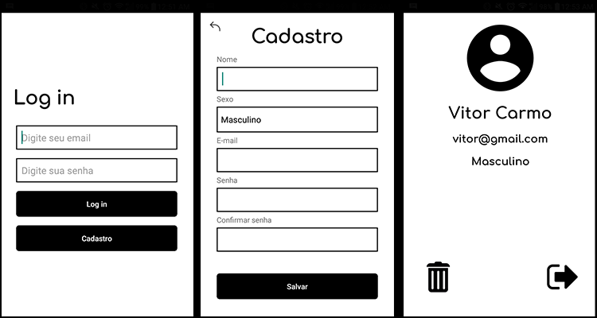

# Simple Login System


A simple login screen with Android Studio for my mobile programming class.


## What I've learned
* How to make a **session** on android with **SharedPreferences**
* How to register a client on **SQLite** with android studio
* How to make a **query** on **SQLite** 
* How to use `alertDialogBuilder` to make the user select a positive or negative option and execute a block of code
* How to change th font of a text on XML layout
* How to use Vectors on android 


## Features
* Create an account
* Sign in with an account
* Sign out of your account
* Delete your account


## Project 
Here are some things that I used in my code
### Register

First of all, if the user does not fill in all the fields, I have to notify him to do so

```java

//  if all fields are null
if (InputIsNull()){
    Toast("Por favor, preencha os campos corretamente!");
     return;
}


// method that checks if all fields are null
private boolean InputIsNull(){
    String empty = "";

    return name.getText().toString().equals(empty)
            || email.getText().toString().equals(empty)
            || password.getText().toString().equals(empty)
            || password_confirm.getText().toString().equals(empty);
}
```

The `Toast` method that I created to notify the user
```java
private void Toast(String text){
    Toast.makeText(this, text, Toast.LENGTH_SHORT).show();
}
```

Checks whether the password and password confirmation fields are the same. Otherwise, notify the user

```java
if (!password.getText().toString().equals(password_confirm.getText().toString())){
    Toast( "Suas senhas não coincidem. Tente novamente.");
    return;
}
```

if everything is all right, than add the user 

```java
String sex = this.sex.getSelectedItem().toString();
String name = this.name.getText().toString();
String password = this.password.getText().toString();
String email = this.email.getText().toString();

// adding the user to the database with the corresponding values
database.addUser(name, sex, email, password);

// notify the user 
Toast("Usuário cadastrado!");

// set disabled to register button
save.setEnabled(false);
```


## Login

Check that all fields are null

```java
if(!InputIsNull()){
    // the code ...
} else{
    Toast.makeText(this, "Por favor, preencher todos os Campos.", Toast.LENGTH_LONG).show();
}


// method that checks if all fields are null
private boolean InputIsNull(){
    String empty = "";
    return emailUser.getText().toString().equals(empty) || passwordUser.getText().toString().equals(empty);
}
```

if the fields are not null, check if the user exists and if the email or password is correct

```java

// checks the database to see if the email exists and that the password is correct
// if the user doesn't exist or the password is wrong, the return will be -1
// if the password and email are correct, it will return the user ID
int userID =  database.loginUser(emailUser.getText().toString(), passwordUser.getText().toString());


// if user id isn't -1 so save his id on a session
if(userID != -1){

    SessionManagement sessionManagement = new SessionManagement(this);


    sessionManagement.saveSession(userID);
    
    // going to user activity
    moveToUserActivity(ID_KEY, userID);

}else{

    // if the password is incorrect or the user doesn't exist
    Toast.makeText(this, "\""+emailUser.getText().toString()+"\", não está associado a nenhuma conta.", Toast.LENGTH_LONG).show();
}
```
Check at the beginning of the activity if the session user ID is defined, if it is, then go to the user's activity
```java
protected void onStart() {
    super.onStart();
    SessionManagement sessionManagement = new SessionManagement(this);
    int userId = sessionManagement.getSession();

    if (userId != -1){
        moveToUserActivity(ID_KEY, userId);
    }

}
```

## User Account

in the oncreate method, I get the ID that I saved in the session and then I get the user data with that ID
```java
SessionManagement sessionManagement = new SessionManagement(this);
int id = sessionManagement.getSession();

// user data with that ID
String[] userdata = database.getUser(id);


name = findViewById(R.id.name);
name.setText(userdata[1]);

loginEmail = findViewById(R.id.loginEmail);
loginEmail.setText(userdata[3]);

loginSex = findViewById(R.id.loginSex);
loginSex.setText(userdata[2]);
```
If the user click on the logout image so delete the session and go to the login activity 

```java
public void logout(View v){
    SessionManagement sessionManagement = new SessionManagement(this);
    sessionManagement.removeSession();

    gotoLoginActivity();
}
```

If the user clicks delete the account, ask them if they really want to do this, then delete the user and go to the login screen


```java
public void deleteUser(View v){

    AlertDialog.Builder alertDialogBuilder = new AlertDialog.Builder(this);

    alertDialogBuilder.setMessage("Você tem certeza que deseja excluir sua conta?");

    //if the user want to delete his account
    alertDialogBuilder.setPositiveButton("deletar",
            new DialogInterface.OnClickListener() {
                @Override
                public void onClick(DialogInterface arg0, int arg1) {
            
                    try {
                        SessionManagement sessionManagement = new SessionManagement(UserActivity.this);
                        database.deleteUser(String.valueOf(sessionManagement.getSession()));

                        sessionManagement.removeSession();

                        Toast("Usuário deletado com sucesso!");

                        gotoLoginActivity();

                    }catch (Exception e){

                        Toast("Erro ao deletar usuário");

                        e.printStackTrace();
                    }
                }
    });


    // if the user change his mind
    alertDialogBuilder.setNegativeButton("cancelar",new DialogInterface.OnClickListener() {
        @Override
        public void onClick(DialogInterface dialog, int which) {
            Toast("Cancelado");
        }
    });

    AlertDialog alertDialog = alertDialogBuilder.create();
    alertDialog.show();

}
```

## Como contribuir

- Faça um fork desse repositório;
- Cria uma branch com a sua feature: `git checkout -b minha-feature`;
- Faça commit das suas alterações: `git commit -m 'feat: Minha nova feature'`;
- Faça push para a sua branch: `git push origin minha-feature`.

Depois que o merge da sua pull request for feito, você pode deletar a sua branch.

___

<h4 align="center">
    Feito com 💜 by  Vitor Carmo
</h4>
